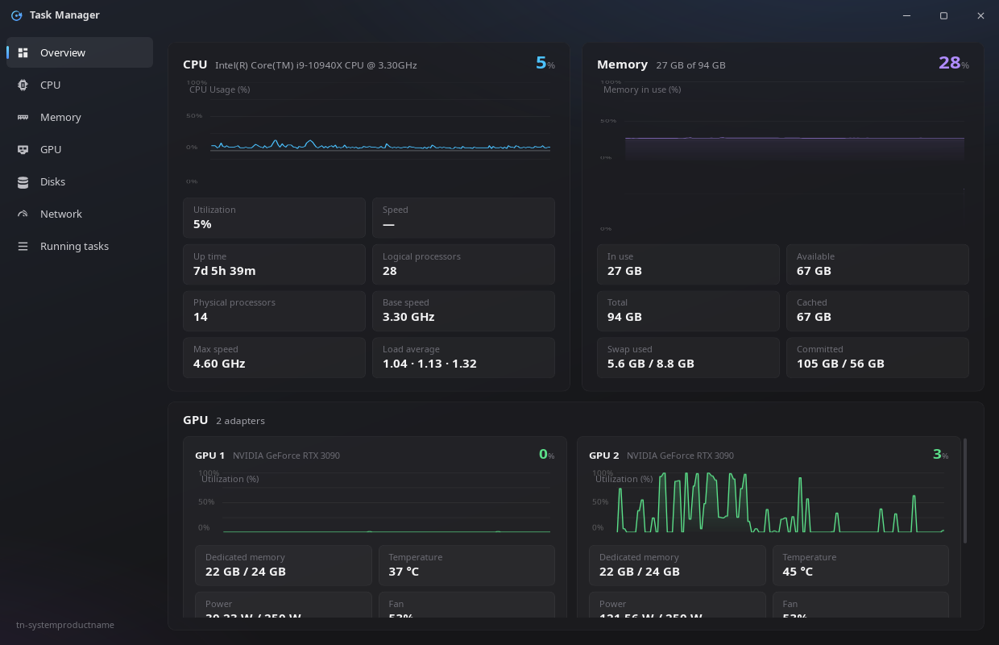
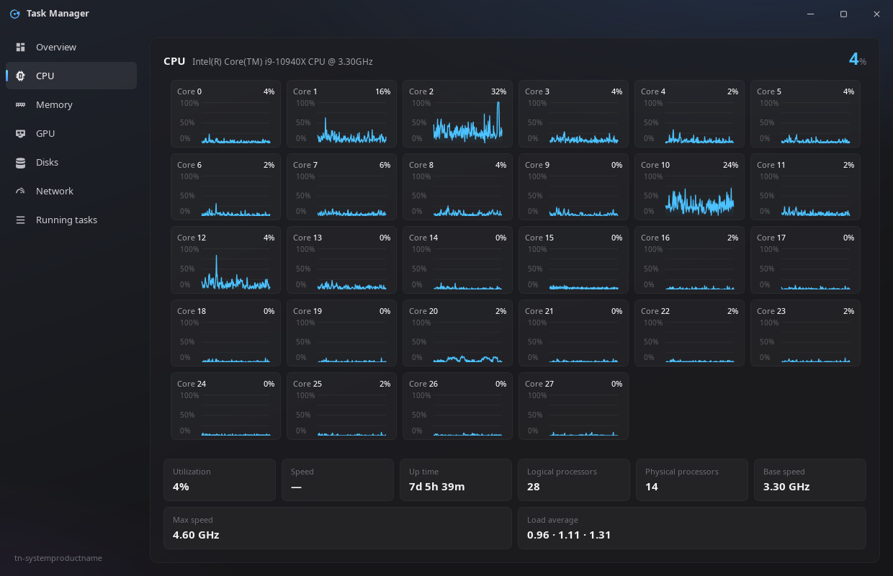
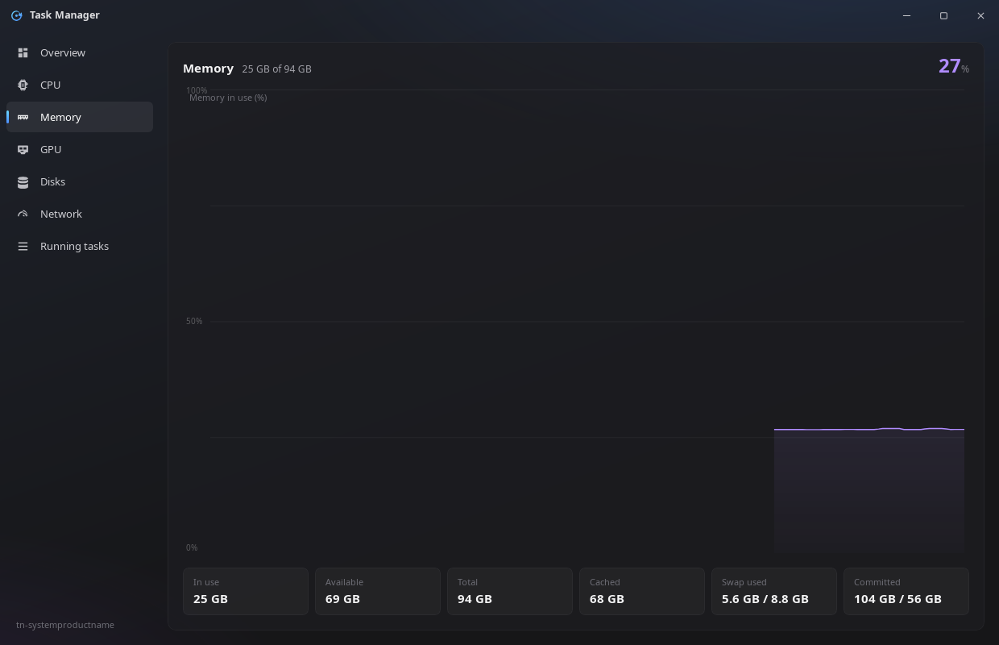
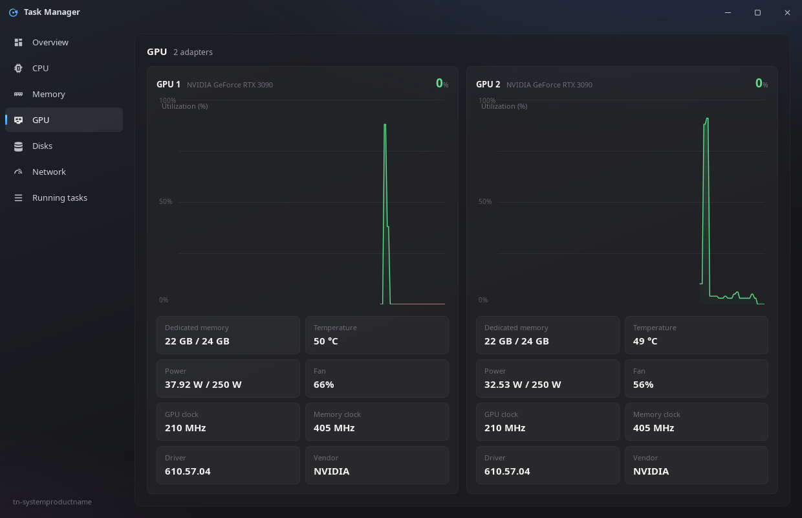
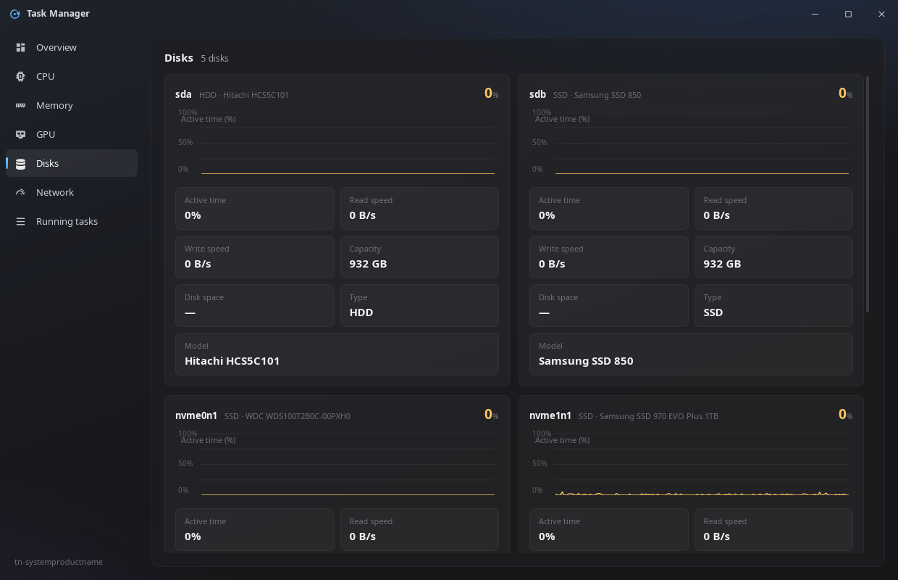
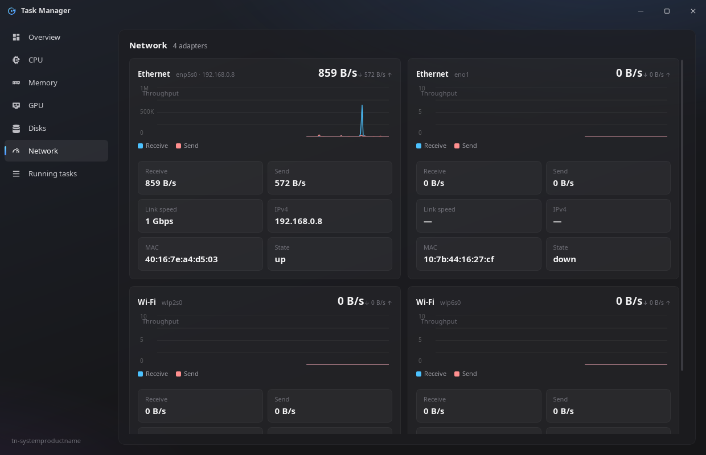
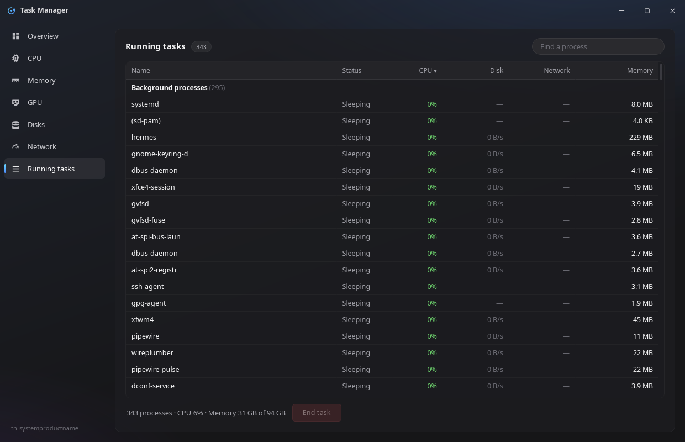

# Task Manager

A lightweight, open-source task manager for Linux — live CPU, memory, GPU,
disk and network monitoring plus a full process list, in a single
undecorated window with no scrolling.

Built with [Tauri v2](https://tauri.app): Rust collectors sample the kernel
directly (`/proc`, sysfs, NVML) every 500 ms, and a small web UI renders the
data. It is one self-contained binary — the whole app runs in ~200 MB of
memory in a debug build.

The project is public on
[GitHub](https://github.com/Evitagen/TaskManager-tauri) under the MIT
license — issues, forks and contributions are welcome.

## Sections

The window never scrolls: whatever is taller than the content area is scaled
vertically to fit (see [fitPage fallback](#platform-notes)). Every
screenshot below is a capture of the real running app — 1240×800 window,
500 ms refresh, graphs warmed up to their full 90 s history window.

### Overview



The landing tab: CPU and Memory side by side on top, one card per GPU below.
Each card pairs a live sparkline (the big number is the headline value) with
the stats that matter most — for CPU: utilization, speed, up time, logical /
physical processors, base / max speed, load average; for Memory: in use,
available, total, cached, swap used/total and committed; per GPU: dedicated
memory, temperature, power and fan.

### CPU



The dedicated CPU view. By default it shows a full-width usage history (one
tick per 500 ms, 90 s window) plus the same stat tiles as the Overview card;
**right-clicking the graph** opens the context menu, and “Show logical cores”
swaps the graph for the grid shown here — one live cell per logical core (28
on the i9-10940X this was built on), each with its own usage history.
Choosing the graph again restores it. The per-core cells and the total are
both computed from the same per-line `/proc/stat` deltas.

### Memory



Memory-in-use history plus the full tile set: in use, available, total,
cached, swap used/total and committed. Values come straight from
`/proc/meminfo` (kB → bytes) with standard cached/buffers accounting.

### GPU



One card per adapter (two RTX 3090 on this host): per-GPU utilization
sparkline, dedicated memory used/total, temperature, power (current / TDP)
and fan. Telemetry comes from NVML via `nvidia-smi --query-gpu` — the test
suite cross-checks VRAM totals against the driver exactly. If NVML is
unavailable the collector falls back to DRM sysfs + `/proc/driver/nvidia` +
`lspci` and sets `telemetry:false`, so the cards still enumerate even without
live numbers.

### Disks



One card per **whole disk** — partitions (`nvme0n1p1`, …) are filtered out —
with an active-time % sparkline (the `io_ticks` delta from
`/proc/diskstats`), read/write speed, capacity, disk space of the largest
mounted partition (10 s cache; `—` when the disk has no mounted partition),
type (SSD/HDD from `queue/rotational`) and model. Card order follows the
`/proc/diskstats` line order, so the grid is stable between ticks — a
regression test pins exactly that.

### Network



One card per physical interface — `lo`, `veth*`, `docker*`, `br-*` and
`virbr*` are excluded. Each card plots RX and TX as two series and shows
receive/send B/s, link speed (`—` when the driver doesn’t report it), IPv4
address, MAC and operstate.

### Running tasks



The live process table: every process on the box, sorted by CPU by default
and sortable by any column header click. Columns are Name, Status, CPU, Disk
and Network I/O (B/s — own-uid processes only, because the kernel hides
other users’ `/proc/<pid>/io`) and Memory. Selecting a
row enables **End task** → confirmation modal → `SIGTERM` (force →
`SIGKILL`); pid ≤ 1 and the app itself are refused with `EPERM`. The footer
carries the process count plus current CPU and memory totals.

## Layout

```
tauri/
├── Cargo.toml / Cargo.lock      # crate (lib name: task_manager_lib) + deps
├── build.rs                     # tauri_build + AppManifest (declares commands)
├── tauri.conf.json              # window 1240×800 (min 940×620), no decorations,
│                                #   identifier com.taskmanager.tauri, frontendDist=frontend
├── capabilities/default.json    # core:default + window perms + our command perms
├── icons/icon.png
├── src/
│   ├── main.rs                  # thin entry: task_manager_lib::run()
│   ├── lib.rs                   # tauri Builder, commands, verify-mode hooks
│   ├── verify.rs                # TM_VERIFY / TM_VERIFY_LAYOUT self-check harness
│   └── collectors/
│       ├── mod.rs               # Hub: performance()/processes() -> exact JSON
│       ├── cpu.rs               # /proc/stat deltas, per-core, freq, load, uptime
│       ├── mem.rs               # /proc/meminfo (kB -> bytes, cached/buffers/swap)
│       ├── disk.rs              # /proc/diskstats deltas + statfs mount usage
│       ├── net.rs               # /proc/net/dev deltas, physical-iface only
│       ├── gpu.rs               # nvidia-smi (NVML) w/ drm + lspci fallbacks
│       ├── procs.rs             # /proc/<pid> snapshot + kill (sigterm/sigkill)
│       └── util.rs              # read helpers + timeout-bounded process runner
├── frontend/
│   ├── index.html / style.css   # static web UI
│   ├── app.js / graph.js        # app logic + canvas graph rendering
│   └── bridge.js                # window.api -> Tauri invoke bridge
├── tests/collectors.rs          # integration tests for the collectors
├── screenshots/                 # README screenshots (one per tab)
├── shots/                       # verify-mode screenshots + xg/mouse X11 helpers
└── .toolchain/                  # in-project rustup/cargo homes (self-contained)
```

## Building & running

A Rust toolchain is vendored in `.toolchain/` (RUSTUP_HOME/CARGO_HOME live there,
so no system-wide rust is required). Every command below is run from this folder
with the toolchain prepended:

```sh
cd tauri
export RUSTUP_HOME=$PWD/.toolchain/rustup
export CARGO_HOME=$PWD/.toolchain/cargo
export PATH=$CARGO_HOME/bin:$PATH

cargo build            # debug binary -> target/debug/task-manager
cargo run              # run it
cargo test             # collector integration tests
```

Release build (LTO + strip, per `[profile.release]`):

```sh
cargo build --release  # -> target/release/task-manager
```

Dependencies used by the build/run on this host: the project toolchain, plus
`libwebkit2gtk` (WebKitGTK 2.52) for the webview. The verify harness (below)
additionally uses `xprop`, ImageMagick (`import`, `magick`), and `gcc` +
libX11 dev headers (to build `shots/xg`, the X-geometry probe).

## Verification harness

Two env-gated modes are wired into `lib.rs` (neither affects normal use):

- `TM_VERIFY=1 ./target/debug/task-manager`
  Warms up for 100 s (so the graphs collect a full 90 s history window for
  the screenshots), then drives the **real UI**: clicks through all seven
  tabs (Overview, CPU — switching it to the per-core grid —, Memory, GPU,
  Disk, Net, Tasks), dumps each visible section's text and the page transform
  to stderr, screenshots each tab, then exercises the end-task flow against a
  spawned `sleep` child (row → End task → confirm) and checks the kill
  result. Prints `KILLTEST PASS/FAIL` and exits.

- `TM_VERIFY_LAYOUT=1 ./target/debug/task-manager`
  Dumps layout geometry (rects/display of the page, sections, graphs, canvas),
  the fit-scaler's measured vs. available height, and the per-core right-click
  flow (context menu → "Show logical cores" → 28 core cells). Exits.

Screenshots are written to `shots/tauri_<tab>.png`. Because Tauri v2 exposes no
window-capture API on Linux, the harness captures the **root window** with
`import -window root` and crops to this app's X window geometry (queried by the
`shots/xg` probe). This is the composited on-screen truth. Verify mode retitles
the window to `Task Manager [Tauri Verify]` so the capture tools can find it
unambiguously even when other windows share the plain title.

## JSON contract (frontend ↔ Rust)

`perf_sample` → `{ ts, host, platform, cpu{…}, memory{…}, disks[], gpus[], nets[] }`
`proc_sample` → `{ ts, procs[{pid,name,state,uid,user,cpu,mem,diskBs,netBs,cmdline,isApp,isSelf}], selfUid }`
`meta_get`    → `{ app, version, platform, arch, hostname }`
`proc_kill`   → `{ ok, error? }`

Field names are camelCase (`serde rename_all`) and match every consumer in
`frontend/app.js`. Rates (B/s, %, MHz, GHz) are computed as deltas over the
500 ms sampling interval.

## Platform notes

- **`WEBKIT_DISABLE_COMPOSITING_MODE=1` is set in `run()`** (before the webview
  is created). On this host (picom with the xrender backend), WebKitGTK's
  accelerated GL compositing path does not reach the window pixmap / compositor,
  which would leave the window a flat background. Plain compositing mode renders
  correctly and is what the screenshots above were captured with.
- **`fitPage()` rAF fallback.** WebKitGTK pauses `requestAnimationFrame` while
  the webview is not being composited, so the fit-scaler also runs on a short
  timeout. Behaviour is unchanged in Chromium (rAF path wins, timeout is a no-op).
- **GPU source.** Primary path is `nvidia-smi` (NVML); if that is unavailable the
  collector falls back to DRM sysfs and `/proc/driver/nvidia` + `lspci`, and
  marks `telemetry:false`. On this host NVML is live (2× RTX 3090).
- **`isApp` / `isSelf` window tagging** depends on `wmctrl`; when `wmctrl` is
  not installed, `isApp` is empty. `isSelf` is always populated.
- **CPU "Speed" may be null** on CPUs whose `cpuinfo` lacks `cpu MHz` (e.g. this
  Skylake-X); the UI then shows `—`.
- **Window drag & resize.** WebKitGTK ignores Chromium's `-webkit-app-region:
  drag` (and a `decorations:false` window has no OS-side resize borders either),
  so `bridge.js` drives the core `plugin:window|start_dragging` command on
  titlebar mousedown and `plugin:window|start_resize_dragging` from eight
  invisible edge/corner hit-strips with the matching cursors. The 940×620
  minimum size is still enforced by the window manager.

## Commands (Tauri invoke surface)

| Command       | Args            | Returns                          |
|---------------|-----------------|----------------------------------|
| `perf_sample` | —               | perf payload (above)             |
| `proc_sample` | —               | procs payload (above)            |
| `proc_kill`   | `{pid, force}`  | `{ok, error?}` (EPERM if pid≤1 or self) |
| `meta_get`    | —               | meta payload                     |
| `debug_log`   | `{text}`        | — (verify-mode logging hook)     |

Window controls use the `plugin:window|…` core commands (`minimize`,
`maximize`, `unmaximize`, `is_maximized`, `close`, `start_dragging`,
`start_resize_dragging`) with `{label:'main'}`.

## License

MIT — see [LICENSE](LICENSE). Free to use, fork and build on, no strings
attached.
